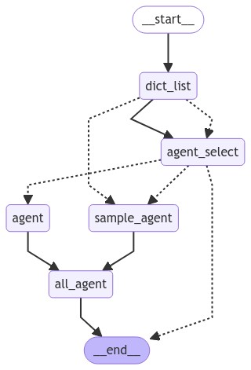

# Engineering-Code-Analysis
使用Openai有关项目工程的代码解释器

## 简介

本项目是一款创新的本地化AI助手系统,
旨在突破传统在线AI服务的局限。它支持直接访问本地文件夹,
无文件大小限制,能高效解析GitHub项目,
同时保证数据仅存储在本地以提高安全性。

### 工作流框架


### Demo


## 优势

- **直接访问本地文件**：在您本地环境中运行代码，确保各种依赖都已正确安装。

- **文件大小及访问速度提升**：告别100MB文件大小限制和网速问题。使用本地版，一切尽在掌控之中。

- **显式访问网络连接**：官方无法显式访问网页链接，对github项目不友好，该工程可以对github项目进行解析。
-  **数据安全**：代码在本地运行，无需将文件上至网络，提高了数据的安全性。

## 注意事项
本地设备上执行AI生成但未经人工审核的代码可能存在安全风险。若未经审核运行程序所产生的所有后果，您需自行承担。

## 使用方法

### 安装

1. 克隆本仓库
   ```shell
   git clone https://github.com/syzhy113/Engineering-Code-Analysis.git
   cd Engineering-Code-Analys
   ```

2. 安装依赖。该程序已在Windows 11和ubuntu18.04测试。所需的库及版本：
   ```text 

   ```
   可以直接使用以下命令安装
   ```shell
   pip install -r requirements.txt
   ```

### API获取
1. 

2. 
### Github token获取
1. 

2. 

## 使用

1. 进入`src`目录。
   ```shell
   cd src
   ```

2. 运行以下命令：
   ```shell
   python main.py
   ```

3. 在命令行中，完成对话使用


## 示例

以下是一个使用本程序进行工程任务分析的示例：

1. ：
   


